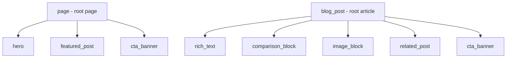
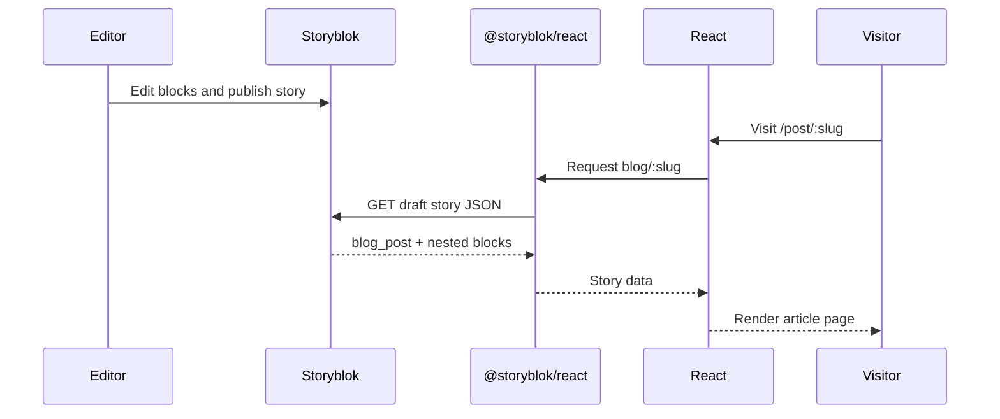
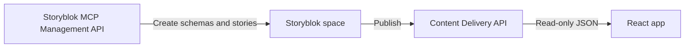

# Sustaind blog — Storyblok + React

This project recreates the editorial shape of the Sustaind reference article:

<https://www.sustaind.in/post/verra-or-gold-standard-choosing-the-right-registry-for-your-carbon-project>

The frontend is a React/Vite site. Storyblok stores the article structure and content. The local files in `public/` provide the tutorial images.

## Architecture

```mermaid
flowchart LR
  A[Storyblok component schemas] --> B[Draft or published stories]
  B --> C[Storyblok Content Delivery API]
  C --> D[@storyblok/react SDK]
  D --> E[React component registry]
  E --> F[Rendered Sustaind blog]
```

Storyblok is headless: it stores structured content, but React controls the final layout and styling.

## Environment setup

Create `.env.local` with:

```env
VITE_STORYBLOK_DELIVERY_API_TOKEN=your_preview_delivery_token
VITE_STORYBLOK_REGION=eu
VITE_STORYBLOK_SPACE_ID=294918728150702
VITE_STORYBLOK_CONTENT_VERSION=draft
```

`VITE_STORYBLOK_DELIVERY_API_TOKEN` should be the space's read-only Preview access token. The app also accepts `VITE_STORYBLOK_ACCESS_TOKEN` as a fallback for older setups. Vite only exposes variables beginning with `VITE_` to browser code, so never put a Storyblok Management API token in a `VITE_` variable. `.env.local` is ignored by git.

Use `draft` for the Netlify Visual Editor deployment. A production deployment should set:

```env
VITE_STORYBLOK_CONTENT_VERSION=published
```

Restart the dev server after changing environment variables:

```bash
npm run dev
```

## SDK connection

The SDK is connected in [`src/main.tsx`](src/main.tsx):

```tsx
storyblokInit({
  accessToken: import.meta.env.VITE_STORYBLOK_DELIVERY_API_TOKEN || import.meta.env.VITE_STORYBLOK_ACCESS_TOKEN,
  use: [apiPlugin],
  components: {
    page: Page,
    blog_post: BlogPost,
    hero: Hero,
    featured_post: FeaturedPost,
    rich_text: RichText,
    comparison_block: ComparisonBlock,
    image_block: ImageBlock,
    related_post: RelatedPost,
    cta_banner: CtaBanner,
  },
  apiOptions: { region: import.meta.env.VITE_STORYBLOK_REGION || 'eu' },
})
```

This:

1. Reads the Preview delivery token.
2. Activates Storyblok’s API plugin.
3. Registers every Storyblok technical component name with a React component.
4. Selects the EU Storyblok region.

## Components created in Storyblok



### Root content types

| Technical name | Purpose |
|---|---|
| `page` | Landing pages such as `home`. Its `body` field accepts `hero`, `featured_post`, and `cta_banner`. |
| `blog_post` | Articles with title, excerpt, author, date, category, read time, cover image, and body blocks. |

### Nestable blocks

| Technical name | Purpose |
|---|---|
| `hero` | Homepage introduction with headline, body, CTA, and stat. |
| `featured_post` | Featured article card on the homepage. |
| `rich_text` | Paragraphs, headings, and lists inside an article. |
| `comparison_block` | Diagram section using `public/flowchart.webp`. |
| `image_block` | Editorial image with URL, alt text, and caption. |
| `related_post` | Related article card at the end of an article. |
| `cta_banner` | Contact or consulting call-to-action section. |

The `Blocks` field restrictions in Storyblok control which blocks editors can add in each location.

## How content becomes UI

The renderers live in [`src/storyblok/blocks.tsx`](src/storyblok/blocks.tsx).



`StoryblokComponent` performs the block lookup:

```tsx
<StoryblokComponent blok={child} />
```

If `child.component` is `comparison_block`, the registry calls `ComparisonBlock`. If it is `rich_text`, it calls `RichText`.

Each renderer also uses `storyblokEditable(blok)`, which adds metadata that helps the Storyblok Visual Editor identify the matching rendered block.

## Routes

| Route | Behavior |
|---|---|
| `/` | Fetches the published `home` story. |
| `/blog` | Lists all published stories below the `blog/` folder. |
| `/post/:slug` | Fetches an article such as `blog/verra-or-gold-standard-choosing-the-right-registry-for-your-carbon-project`. |
| `/blog/:slug` | Alias route for the same article renderer. |

The requested article is available at:

```text
/post/verra-or-gold-standard-choosing-the-right-registry-for-your-carbon-project
```

## Images

The Storyblok stories use local public paths:

| File | Usage |
|---|---|
| `public/hero-img.webp` | Main article cover and homepage feature image. |
| `public/flowchart.webp` | Verra versus Gold Standard comparison diagram. |
| `public/blog-img.webp` | ESG image and related post. |
| `public/sustaind.jpeg` | Reference screenshot used while building the layout. |

For this local demo, image URLs are text fields such as `/hero-img.webp`. In production, replace them with Storyblok Asset fields so editors can upload and manage images directly in Storyblok.

## Netlify Visual Editor preview

The repository includes [`netlify.toml`](netlify.toml) with a single-page-app rewrite. This makes direct visits and refreshes work for React Router URLs such as `/post/<slug>`.

Configure the Netlify site with:

```text
Build command: npm run build
Publish directory: dist
```

Add these environment variables in Netlify's site settings:

```env
VITE_STORYBLOK_DELIVERY_API_TOKEN=your_preview_delivery_token
VITE_STORYBLOK_REGION=eu
VITE_STORYBLOK_SPACE_ID=294918728150702
VITE_STORYBLOK_CONTENT_VERSION=draft
```

After the first deploy, open Storyblok **Settings → Visual Editor** and set the default environment to the HTTPS Netlify URL. Configure the `home` story's real path as `/`, because the React app renders that story on `/` rather than `/home`. For article stories, use `/post/{slug}` as the real path.

Netlify supplies HTTPS automatically, which is required by the embedded Visual Editor. When an editor changes and saves a block, the deployed preview continues to read the draft API version; publishing the story makes the same content available to a published deployment.

The command below is not required for this repository:

```bash
npx storyblok@latest create --token <preview-token>
```

That command scaffolds a new Storyblok project. This app already has its Vite project, Storyblok space, schemas, and content stories.

## Editor workflow

1. Open the Storyblok **Blog** folder.
2. Create a story using **Blog post**.
3. Enter the article metadata and cover image path.
4. Add `Rich text`, `Comparison diagram`, `Article image`, `Related post`, or `CTA banner` blocks to the body.
5. Arrange the blocks in the desired order.
6. Publish the story.
7. Save the story to preview it, then publish it when it is ready.
8. Visit `/post/<story-slug>` or open the story in Storyblok's Visual Editor.

No React code is required for editors to create another article using the existing block types.

## Storyblok management versus delivery



The Management API was used to create the components and seed the content in space `294918728150702`. The browser uses only the read-only delivery token to fetch draft content in preview mode or published content in production mode.

## Verification

```bash
npm run build
npm run lint
```

Both checks should pass before deployment. The Storyblok CDN should return the draft home story plus the draft blog posts when `VITE_STORYBLOK_CONTENT_VERSION=draft` is configured.
